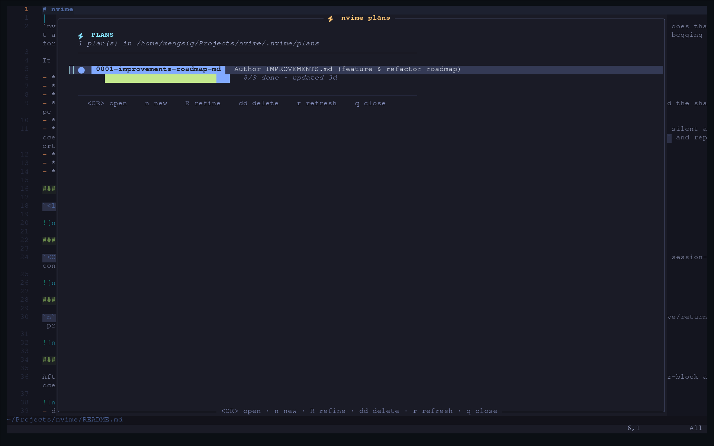
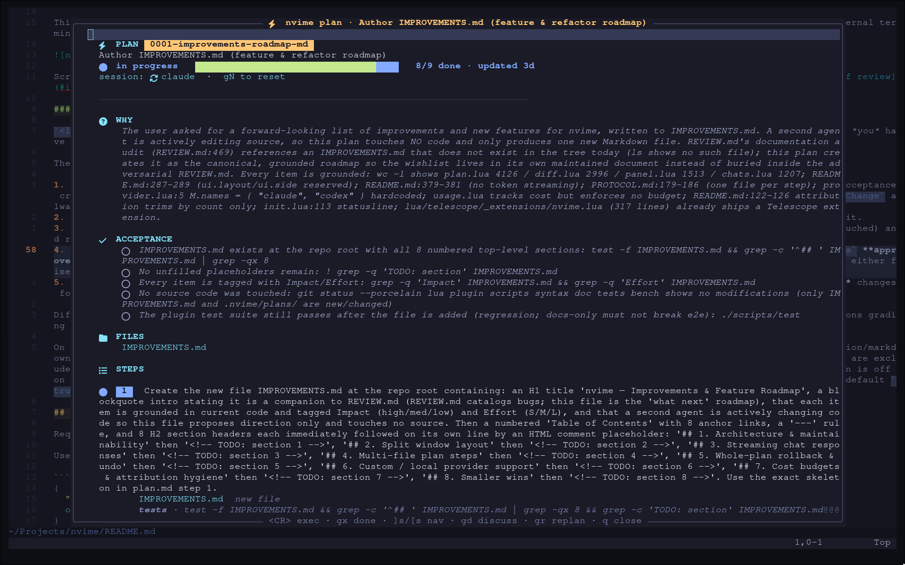
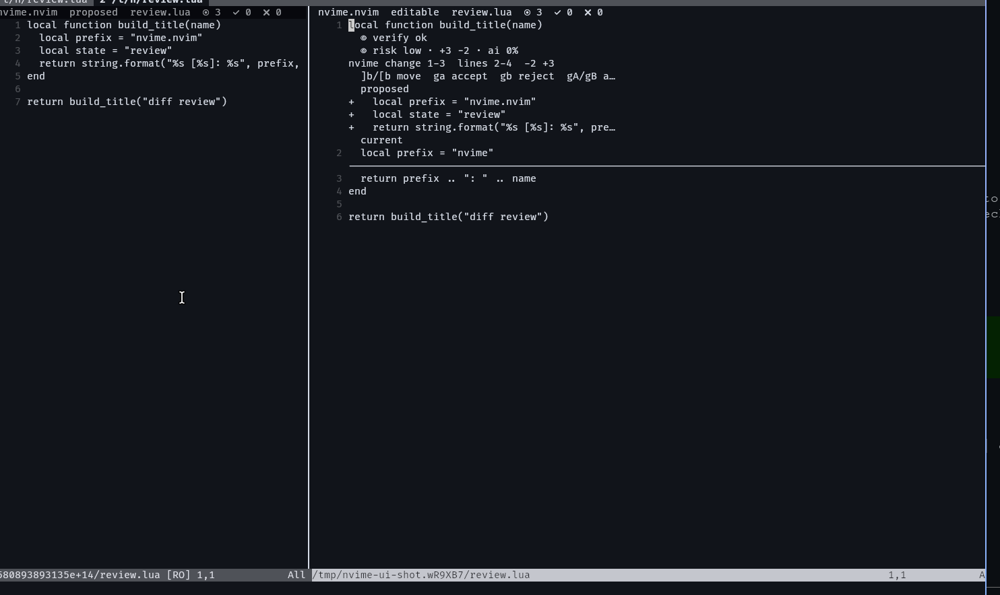
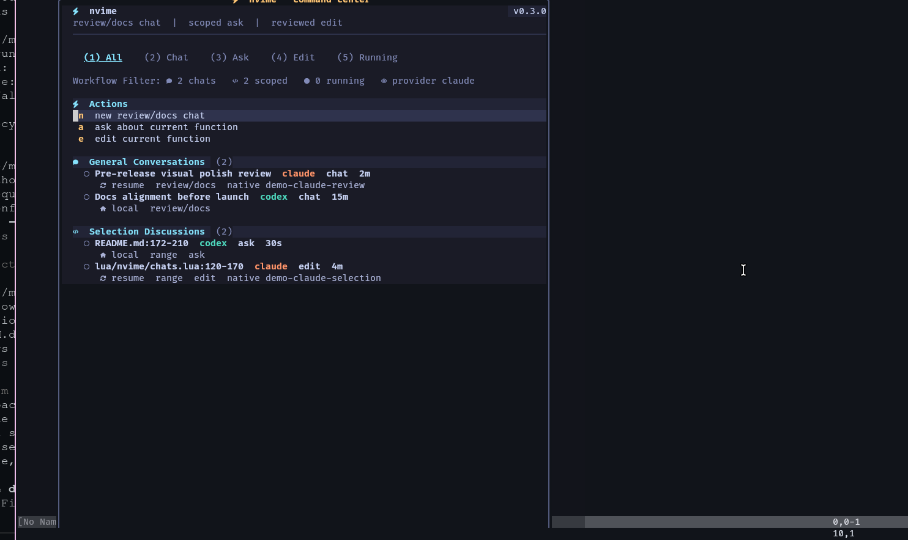
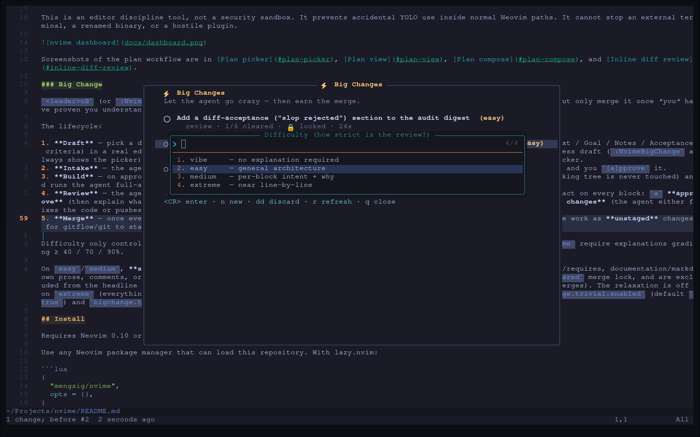
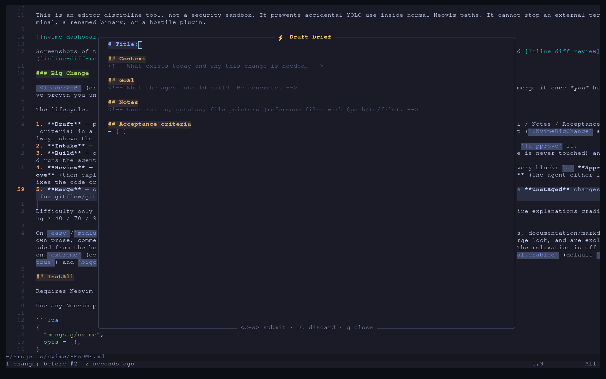
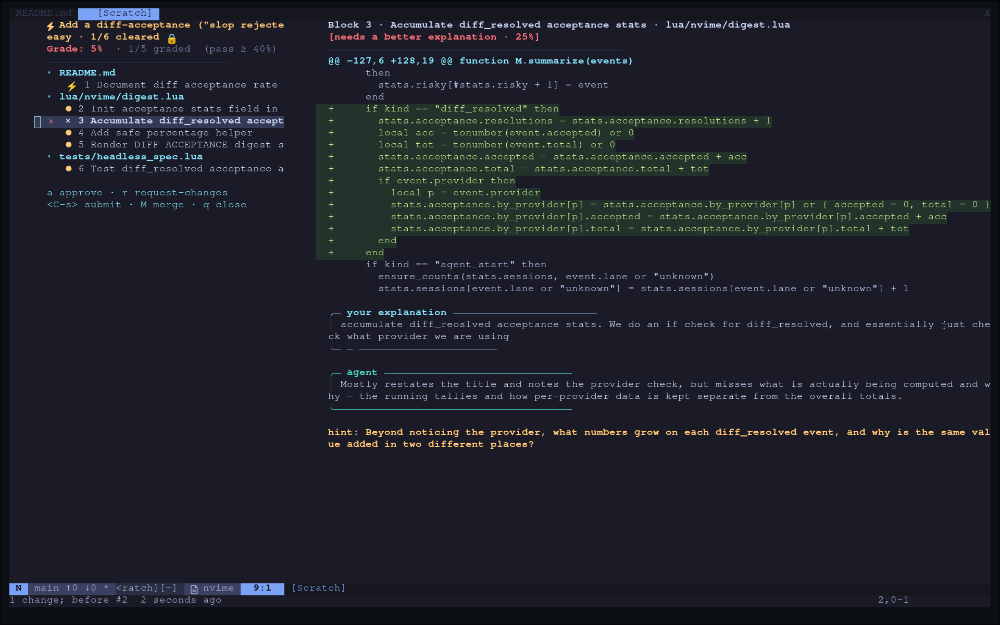
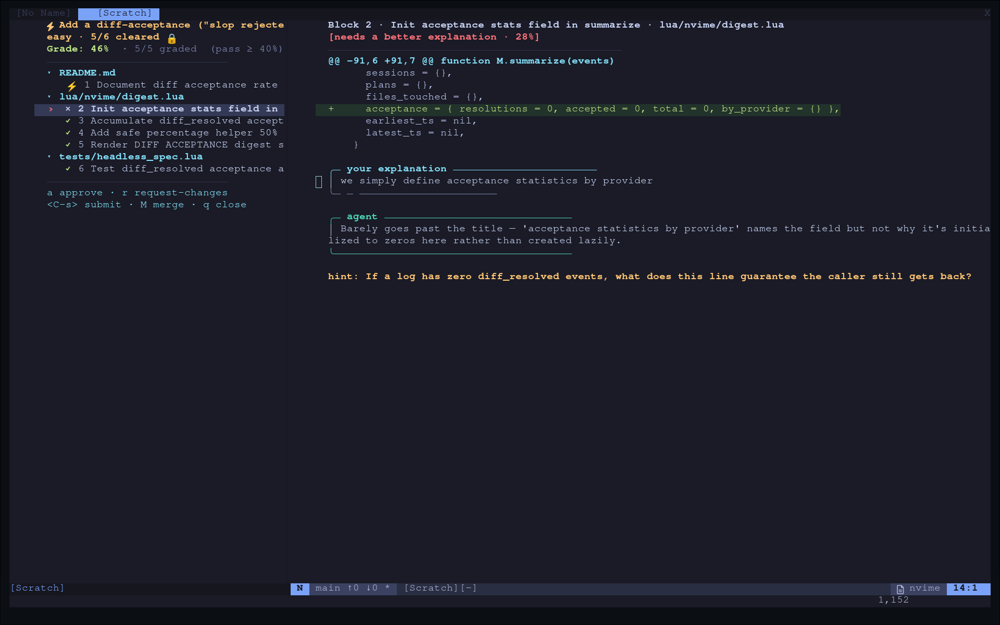
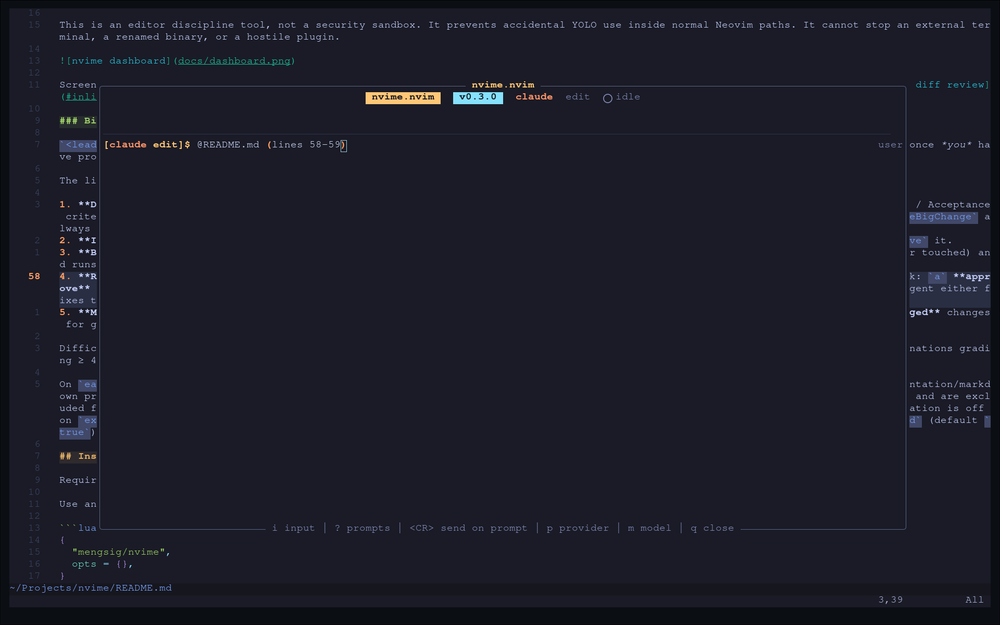

# nvime

`nvime` — No Vibe (Coding) In My Editor. The AI keeps its hands off your code until you tell it exactly where, how, and why — then it does that and not one keystroke more. No sprawl. No mystery edits. No drive-by refactors. No hallucinated helpers. No "oops, I rewrote your repo." This is your editor — the model is a guest, and guests don't touch the knives. Simply put... no bullshit.

It is a Neovim Lua plugin for getting real shit done with Claude Code and Codex CLI through explicit engineering lanes:

- **review/docs**: roam the repo, read shell/tests, write Markdown — no code edits
- **edit**: one range, one file, written intent or it doesn't move
- **generation**: fill blank ranges or non-code files like `.gitignore`
- **plan**: a three-phase flow on the Big Change engine. **Phase 0** — the agent drafts a roadmap (`.nvime/plans/<id>/plan.json` + `plan.md`) read-only; you read it and press `ga` to **agree**. **Phase 1** — in an isolated worktree the agent writes only inert `TODO(nvime):` scaffolding (comments, new files, type stubs — no behavior); you review it at *vibe*, editing the TODOs directly or asking the agent to revise. **Phase 2** — you pick "require understanding?" (no → *vibe*, yes → *easy*), the agent implements the reviewed scaffolding, and you review block-by-block before `M` lands an unstaged branch. Code lands only where you approved the shape.
- **rationalized patches**: every edit ships a one-line `RATIONALE:` (bug → patch → why) in the diff banner before you accept
- **pre-accept verify lane**: tree-sitter parse + configured linters/type-checkers run against the proposed file content; parse errors block silent accept (`gA!` overrides and writes a `verify_force` audit event). Agents that have the nvime MCP server can self-check via `nvime.verify_file` and report a `VERIFY:` line — belt-and-suspenders, never the contract
- **devil's-advocate critic**: opt-in second pass returns APPROVE / FLAG / REJECT — advisory, never blocks
- **auto-rollback**: tests fail after accept? one keystroke restores the pre-edit file

### Plan picker

`<leader>nP` opens the plan picker — every plan in `.nvime/plans/` plus a live "drafting…" row when an author run is in flight.



### Plan view (phase 0)

`<CR>` on a plan row opens the phase-0 research view — sectioned WHY / ACCEPTANCE / FILES / STEPS with the proposed roadmap, the phase banner, and a session-continuity badge. Press `<CR>` or `ga` to **agree** and start phase 1 (the agent scaffolds `TODO(nvime):` markers in an isolated worktree). `gd` refines the plan, `gr` replans, `gN` resets the author session.



### Phase 1 / 2 review

Phases 1 (scaffold) and 2 (implement) run in the Big Change review view: a file→block tree on the left, the real worktree file (editable — change the TODOs in place) on the right. Phase 1 is *vibe* (approve to clear, `r` to ask the agent to revise); `M` advances to phase 2, where you choose the review strictness and the agent implements before you review and merge.

### Plan compose

`n` (or `<C-n>`, `N`) in the picker — or `<leader>nP` followed by `n` — opens the persistent compose buffer. Multi-line, free-form, edit/leave/return preserves the draft. `<C-s>` submits to the plan author agent.

### Inline diff review

The edit lane's inline diff opens in the target file with a `RATIONALE:` banner from the patch worker, optional critic verdict, per-block accept/reject controls, and conflict detection if the file drifted under the agent.


- diff review: agent output becomes a current-file inline diff; accepted lines or blocks are applied by `nvime`
- guardrail lane: direct `claude`/`codex` launches from common Neovim process APIs are blocked and audited

This is an editor discipline tool, not a security sandbox. It prevents accidental YOLO use inside normal Neovim paths. It cannot stop an external terminal, a renamed binary, or a hostile plugin.



Screenshots of the plan workflow are in [Plan picker](#plan-picker), [Plan view](#plan-view), [Plan compose](#plan-compose), and [Inline diff review](#inline-diff-review).

### Big Change

`<leader>nB` (or `:NvimeBigChange`) opens the **Big Change** lane — let the agent build a whole feature autonomously, but only merge it once *you* have proven you understand every change.



The lifecycle:

1. **Draft** — pick a difficulty (`vibe` / `easy` / `medium` / `extreme`), then write a structured brief (Title / Context / Goal / Notes / Acceptance criteria) in a real editable buffer. It autosaves and is reopenable: `<leader>nB` jumps straight back into an in-progress draft (`:NvimeBigChange` always shows the picker). `<C-s>` submits it, `DD` discards it. The `# Title:` line becomes the project's name in the picker.
2. **Intake** — the agent interrogates you with clarifying questions until the spec is crystal clear, writes that spec, and you `[a]pprove` it.
3. **Build** — on approval, `nvime` creates an isolated git worktree under `stdpath('data')/nvime/bigchange/` (your working tree is never touched) and runs the agent full-auto inside it. Progress streams live; you can `q` to background it.
4. **Review** — the agent groups its own diff into semantic blocks. In a dual-pane view (block tree + inline diff) you act on every block: `a` **approve** (then explain what it does — the agent grades your explanation against the difficulty threshold) or `r` **request changes** (the agent either fixes the code or pushes back if the critique is wrong). `X` **explain anyway** re-locks a self-evident block that was auto-cleared as trivial, so you can demand the comprehension gate on it. `S` submits a round; `M` merges.
5. **Merge** — once every block is cleared, `M` prompts for a branch name, creates it in your main tree, and applies the work as **unstaged** changes for gitflow/git to stage and commit. The worktree is kept until you `d`iscard it from the picker.

The structured brief you fill in during **Draft** (Title / Context / Goal / Notes / Acceptance criteria):



The forced-comprehension **Review** — block tree on the left, inline diff on the right. On `a`pprove you explain what the block does and the agent grades your explanation against the difficulty threshold (hereuner, we show 2 cases where we get denied for different reasons on `easy` mode:





Difficulty only controls review strictness: `vibe` clears blocks on approve with no explanation; `easy`/`medium`/`extreme` require explanations grading ≥ 40 / 70 / 90%.

On `easy`/`medium`, **self-evident blocks auto-clear** with no explanation: blocks whose changed lines are only imports/requires, documentation/markdown prose, comments, or version/config value bumps. They show as `⚡ trivial · auto-cleared`, count toward the `X/Y cleared` merge lock, and are excluded from the headline comprehension Grade (so a change made entirely of trivial blocks shows no Grade line but still merges). The relaxation is off on `extreme` (everything must be explained) and is a no-op on `vibe` (which already auto-clears). Tune it with `bigchange.trivial.enabled` (default `true`) and `bigchange.trivial.doc_globs` (which files count as documentation).

## Install

Requires Neovim 0.10 or newer.

Use any Neovim package manager that can load this repository. With lazy.nvim:

```lua
{
  "mengsig/nvime",
  opts = {},
}
```

For local development from this checkout, use:

```lua
{
  dir = "/path/to/nvime",
  name = "nvime",
  opts = {},
}
```

With lazy.nvim, `opts = {}` is enough because lazy calls `setup({})` for you.
If the plugin is loaded directly from `runtimepath`, `plugin/nvime.lua`
registers the defaults. Call `require("nvime").setup({ ... })` only when you
want to override them.
Repeated identical `setup()` calls are ignored. Use
`force = true` in the setup opts when you intentionally want to re-initialize
wrappers, commands, and keymaps.
Unknown config keys and obvious type mismatches are reported with `vim.notify`
when setup runs.

## Configuration

Defaults are intentionally usable without configuration. These are the current
defaults:

```lua
require("nvime").setup({
  provider = "claude", -- "claude" or "codex"
  providers = {
    claude = {
      cmd = "claude",
      models = { "opus", "sonnet", "haiku" },
    },
    codex = {
      cmd = "codex",
      models = { "gpt-5.5", "gpt-5.4", "gpt-5.4-mini", "gpt-5.3-codex-spark" },
      reasoning_effort = nil,
    },
  },
  ui = {
    layout = "float", -- "float" or "split"
    width = 82,
    side = "right",
    height = 24,
    float_width = 0.82,
    float_height = 0.72,
    dashboard_width = 0.86,
    dashboard_height = 0.9,
    border = "rounded",
    backdrop = 60, -- false disables the dimmed dashboard backdrop
    completion = "notify", -- "notify" or "open" when a hidden agent finishes
    nerd_font = true, -- Nerd Font glyphs (set false for geometric Unicode only)
    ascii_icons = false, -- set true for terminals without glyph support
    icons = {}, -- optional per-icon overrides
    spinner_frames = nil, -- optional custom frame list for running agents
  },
  audit = {
    enabled = true,
    path = nil, -- defaults to .nvime/audit.jsonl in a git repo
    log_prompts = false,
  },
  attribution = {
    enabled = true,
    path = nil, -- defaults to .nvime/attribution.json in a git repo
    max = 500,  -- oldest entries trimmed when the ledger exceeds this count
  },
  recap = {
    auto_open = true, -- open the recap plan view after :NvimeRecap drafts it
  },
  guard = {
    enabled = true,
    strict = true,
    notify = true,
    kill_blocked_terminals = true,
    block_cmdline = true,
    wrap_vim_system = true,
    wrap_jobstart = true,
    wrap_termopen = true,
    wrap_system_functions = true,
    wrap_uv_spawn = true,
  },
  review = {
    allow_shell = true,
    allow_web = true,
    allow_markdown_writes = true,
  },
  selection = {
    allow_shell = true,
    allow_web = true,
  },
  edit = {
    context_lines = 0,
    inject_context = true,
    context_max_chars = 6000,
    related_test_limit = 4,
    symbol_limit = 24,
    recent_diff_limit = 5,
  },
  diff = {
    max_visual_block_lines = 12,
    devils_advocate = false,
  },
  verify = {
    enabled = true,
    treesitter_parse = true,
    block_on_parse_error = true,
    timeout_ms = 8000,
    checks = {},
  },
  risk = {
    enabled = true,
    sensitive_paths = nil,    -- defaults: migrations/lockfiles/secrets/keys
    generated_globs = nil,    -- defaults: protobuf/_generated/generated dirs
    thresholds = {
      lines = { medium = 40, high = 120 },
      ai_share = { high = 0.5 },
    },
    confirm_on_force_high = true,
  },
  policy_rules = {
    enabled = true,
    path = nil, -- defaults to .nvime/policy.json in git root
  },
  intent = {
    enabled = true,
    min_words = 4,
    classifier = "heuristic",
    model_timeout_ms = 5000,
  },
  pr = {
    enabled = true,
    path = nil, -- defaults to .nvime/pr.md in git root
    base_branch = nil,
    include_unattributed = true,
  },
  chat = {
    max_history_messages = 24,
  },
  plan = {
    enabled = true,
    dir = nil, -- defaults to <git-root>/.nvime/plans
    auto_open = true,
    auto_in_progress = true,
    inject_context_chars = 480,
    devils_advocate = true,
    test_file = nil,
    test_runner = nil,
    session_continuity = "plan", -- "plan" or "none"
  },
  sessions = {
    enabled = true,
    path = nil, -- defaults to .nvime/selection-sessions.json in a git repo
    chat_path = nil, -- defaults to .nvime/chat-sessions.json in a git repo
    max = 100,
  },
  usage = {
    enabled = true,
    path = nil, -- defaults to .nvime/usage.json in a git repo
    max_days = 90,
    statusline = true,
    rates = {},
  },
  test_loop = {
    enabled = true,
    runner = nil, -- nil means plan.test_runner / auto-detect
    auto_fix = false,
    max_retries = 2,
    capture_lines = 200,
  },
  mcp = {
    enabled = true,
    config_path = nil, -- defaults to .nvime/mcp.json in a git repo
    servers = {},
    expose_self = true,
    self_command = nil,
    codex_bypass_for_mcp = false,
  },
  keys = {
    enabled = true,
    prefix = "<leader>n",
    normal = {
      dashboard = "<Space>",
      chat = "c",
      review = "r",
      edit = "e",
      ask = "q",
      audit = "a",
      discuss = "d",
      diff = "v",
      last = "n",
      provider = "p",
      model = "m",
      plan = "P",
      blame = "b",
      usage = "u",
      usage_dashboard = "D",
      quick_fix = "f",
      send = "s",
    },
    visual = {
      edit = "e",
      ask = "q",
      quick_fix = "f",
      send = "s",
    },
  },
  prompts = {
    general = {
      { label = "Review repository", prompt = "Please review this repository..." },
      { label = "Update docs", prompt = "Please inspect the repository and ensure the Markdown documentation is accurate..." },
      { label = "Explain architecture", prompt = "Please explain the repository architecture..." },
      { label = "Run tests", prompt = "Please run the relevant tests/checks..." },
    },
    selection = {
      { label = "Review selection", prompt = "Please review this selection..." },
      { label = "Explain selection", prompt = "Please explain what this selected code does..." },
      { label = "Suggest minimal diff", prompt = "Please suggest the smallest approvable diff..." },
      { label = "Proceed with fix", prompt = "Please proceed with the concrete fix..." },
      { label = "Benchmark and optimize", prompt = "Profile this selection on representative inputs..." },
    },
    plan = {
      { label = "Investigate before planning", prompt = "Before drafting steps, read the relevant files..." },
      { label = "Refactor with diff budget", prompt = "Decompose this refactor into the smallest reviewable steps..." },
      { label = "Bug investigation plan", prompt = "Identify the root cause, the exact files and ranges to change..." },
    },
  },
})
```

Chat, selection, and discussion picker windows currently use floating scratch
buffers. `ui.layout` and `ui.side` are reserved defaults and do not select a
split layout in v0.3.0.

To disable shipped keymaps:

```lua
require("nvime").setup({
  keys = { enabled = false },
})
```

## Commands

- `:Nvime` opens the Mason-style nvime command center with recent chats,
  selection discussions, running state, tabs, and action rows.
- `:NvimeChat` opens the picker for general chat/review conversations.
- `:NvimeChats [chat|ask|edit]` opens the picker for general chat or highlighted-code Ask/Edit discussions.
- `:NvimeChats search <query>` searches the persisted session archive (chat +
  selection transcripts) by content and reopens the conversation you pick.
  `<leader>n/` prompts for the query.
- `:NvimeReview [claude|codex] [prompt]` opens a review/docs session and *stages*
  the prompt in the input — edit it, then `<CR>` to send. Append `!`
  (`:NvimeReview!`) to launch immediately with the current worktree diff. If a
  review is already running, `<leader>nr` opens the picker instead of stacking a
  duplicate prompt onto the live session.
- `:NvimeLast` reopens the last used general chat or Ask/Edit discussion.
- `:NvimeSend` stages the current file as an `@path` reference in the last-opened
  conversation. In netrw it sends the marked files (or the entry under the
  cursor); with a range (`:'<,'>NvimeSend`) it appends the highlighted line span,
  e.g. `@lua/nvime/chat.lua (lines 10-25)`.
- `:NvimeAsk [claude|codex] <question>` asks the read-only side agent about the visual range or current function.
- `:'<,'>NvimeEdit [claude|codex] <intent>` asks for a reviewed edit for the visual range.
- `:NvimeEdit [claude|codex] <intent>` uses the Tree-sitter function at the cursor.
- `:NvimeProvider [claude|codex]` shows or changes the default provider.
- `:NvimeAccept` accepts the current inline diff block.
- `:NvimeAccept!` force-accepts the current inline diff block when the live
  target text no longer matches the hunk nvime reviewed.
- `:NvimeReject` rejects the current inline diff block.
- `:NvimeDiff` opens the active diff in a two-pane review workspace.
- `:NvimeAudit` opens `.nvime/audit.jsonl`. `:NvimeAudit summary [days]` opens a
  digest float (default 7 days) that groups events by lane/provider, ranks the
  most-touched files, reports the diff block acceptance rate (overall and per
  provider) alongside the force-accept count, and surfaces risky events
  (force-accepts, diff conflicts, plan rollbacks). `:NvimeAudit forces` opens a
  focused review of every
  force-accepted diff block — the single class of action that bypassed nvime's
  live-content guard.
- `:NvimeAttribute` shows the attribution entry for the line under the cursor
  (which plan/step authored it, the rationale, the critic verdict, the
  timestamp). `:NvimeAttribute show` paints inline virtual-text annotations on
  every attributed line in the current buffer; `:NvimeAttribute hide` clears
  them. The ledger lives in `.nvime/attribution.json`; entries are anchored to
  the accepted text content so they survive later edits that shift line numbers.
- `:NvimeRecap [--cached] [<rev>..<rev>]` is the reverse-direction "explain my
  changes" lane: takes a git diff, spawns the plan-lane agent in a temp
  workspace, and writes a `plan.md` narrative under `.nvime/plans/recap-<hash>/`
  explaining what changed, why, and what is untested. Auto-opens in the plan
  view.
- `:NvimeMcp [list|config|edit]` lists configured MCP servers, opens the merged
  config, or edits the project-local `.nvime/mcp.json`.
- `:NvimeTestLoop [on|off|auto|ask|reset]` configures nvime's after-diff
  test-feedback loop (enable, disable, force auto-fix, ask before fix, or
  reset retry counters).
- `:NvimePlan` opens the plan picker or drafts a plan; `:NvimePlan agree <id>`
  agrees to a plan and starts the scaffold phase; `:NvimePlan open <id>` opens a
  plan at its current phase. `:NvimePlanFocus` refocuses the active plan UI
  float; `:NvimePlanClose` tears down every plan UI float and backdrop.
- `:NvimeBlame [notify]` shows the agent attribution popup for the line under
  the cursor.
- `:NvimeUsage [summary|reset]` opens the token + cost dashboard (also
  `<leader>nu` / `<leader>nD`), prints a summary, or resets counters.
- `:NvimeHooks [install|uninstall|status]` installs or removes the `prepare-commit-msg` git hook; annotates commits with nvime attribution.
- `:NvimePr [--dry-run] [<base>]` renders `.nvime/pr.md` — a reviewer-facing summary of AI-attributed changes on the current branch.
- `:NvimePolicy [list|check <path> <lane>|edit]` lists, evaluates, or edits per-path policy rules (`.nvime/policy.json`).

## Chat Panel

`:Nvime` opens the command center: a Mason-style floating console with session
counts, running status, block-highlighted tabs, action rows, recent general
chats, recent Ask/Edit discussions, provider/native-resume badges, a dimmed
backdrop, and in-buffer help on `?` / `g?`. On the dashboard, `(1)`-`(5)`
switch the All, Chat, Ask, Edit, and Running tabs; in scoped pickers, `1`-`9`
still open visible session rows.
For statuslines, `require("nvime").statusline()` returns a compact summary such
as `nvime 2` or `nvime 1/3 running`.

General chat and the selection Ask/Edit/quick-fix lanes share one clean
scratch-buffer chat view — transcript above, the active `[provider lane]$`
prompt at the bottom, status in the float title/footer:



`:NvimeChat` opens the general conversation picker. Press `n` to start a fresh
chat/review conversation, or open an older conversation from the list. Each
conversation opens as one floating scratch buffer with the prompt at the
bottom, focused in normal mode. Status lives in the float title/footer rather
than being written into the transcript, so the buffer stays clean: messages,
responses, and the active `[provider]$` prompt. nvime guards the buffer so only
the live prompt line can be changed while typing.
Press `i` or `o` from anywhere in the chat to jump back to the prompt. Press
`<CR>` on the prompt to submit a review/docs chat message. Press `g?` anywhere
in the panel for a themed cheat-sheet of every control — the same `g?` overlay
is available in the diff review and the plan view, so the keys are always one
keystroke from discoverable.

The chat/review lane keeps a transcript and native provider session id per
general conversation. Same-provider follow-ups resume the native Claude/Codex
conversation; switching providers sends that conversation's nvime transcript so
the newly selected provider has the shared context. Review/docs runs reuse a
stable temporary workspace for the provider session, so project-local native
resumes resolve in the same workspace.

While an agent is running, nvime flushes progress events such as start
notifications, tool calls, command activity, and provider-supplied reasoning
summaries into the float footer/status area instead of appending them to the
transcript. Final answers and provider errors still appear in the buffer.

By default the chat/review lane may run shell commands, use web fetch/search,
and create or update Markdown files (`*.md`, `*.markdown`). Shell access also
allows command-line network tools such as `curl` when available on the machine.
It runs providers in a temporary workspace copy and syncs only Markdown changes
back to the real repo. Source/config edits still have to go through
`NvimeEdit` and its reviewed diff flow.

Switch providers with:

```vim
:NvimeProvider codex
:NvimeProvider claude
```

Or use `<leader>np`.

Inside the chat window:

- `i`, `I`, `a`, `A`, `o`, `O`: jump to the prompt
- `?`: choose a configured prompt template
- prompt `<CR>`: submit the current message
- `<C-c>`: cancel the active chat/review agent
- `p`, `<Tab>`: cycle Claude/Codex for the next chat prompt
- `P`: choose Claude or Codex for the next chat prompt
- `<Esc>`: return focus to the scrollback
- `q`: close the floating window

## Default Keymaps

`nvime` ships one conservative `<leader>n` namespace:

- `<leader>n<Space>`: open the dashboard command center
- `<leader>nc`: open the general chat conversation picker
- `<leader>nr`: stage a review/docs prompt (edit, then `<CR>` to send; opens the
  picker if a review is already running)
- `<leader>nq`: open the highlighted-code discussions picker
- visual `<leader>nq`: ask about selected code
- `<leader>ne`: open the highlighted-code discussions picker
- visual `<leader>ne`: edit selected range
- `<leader>na`: open audit log
- `<leader>nd`: discuss the active inline diff state
- `<leader>nv`: open the active diff review workspace
- `<leader>nn`: reopen the last used nvime conversation
- `<leader>np`: choose Claude or Codex
- `<leader>nm`: choose model for the active provider
- `<leader>nP`: open the plan picker (or refocus active plan UI)
- `<leader>nb`: show agent attribution for the current line
- `<leader>nu` / `<leader>nD`: open the token + cost usage dashboard — a
  runway/burn-rate hero (with a calendar run-out date when `usage.budgets.total_usd`
  is set), a heat-mapped daily-cost plot, per-lane cost bars, cache efficiency,
  and stats. In the dashboard: `r` refresh, `t` toggle cost⇄tokens, `]`/`[`
  cycle the plot window (7/14/30/max days), `q` close.
- `<leader>nf`: quick fix at cursor
- visual `<leader>nf`: quick fix visual selection
- `<leader>ns`: send the current file (or netrw marked files / entry under the
  cursor) as an `@path` reference into the last-opened conversation
- visual `<leader>ns`: send the highlighted line range, e.g. `@path (lines 10-25)`
- `<leader>n/`: search the session archive by content and reopen a match
- `<leader>nB`: open the Big Change picker (AI feature build + forced-comprehension review)

Use `NvimeAsk` for questions such as "does this look right?" or "what does
this do?". Use `NvimeEdit` only when you want a concrete patch. If the edit
worker decides the selected code is already right, or if it returns code
identical to the original selection, `nvime` does not open a no-op diff.
Question-shaped and review-shaped `NvimeEdit` requests are routed to the
read-only ask lane, so prompts like "nitpick this README" can report findings
before a later "please fix" turns them into a patch.
For generation, select the blank line or placeholder range where the new
content should go, then run visual `<leader>ne` and describe the function,
ignore entries, config snippet, comment, or other current-file text you want.
`NvimeAsk` and `NvimeEdit` keep workflow discussions per selected file/range,
while general chat keeps separate conversations in `nvime://chat/<id>` buffers.
Visual `<leader>nq`/`<leader>ne` asks whether to start fresh or continue an
older discussion. Exact range matches are listed first, then same-file
discussions, then recent repo discussions, so a newly highlighted range can
reuse context from a persisted conversation. Continuing a discussion uses the
provider's native session resume when nvime has captured a Claude/Codex session
id; starting new creates a separate nvime discussion and a separate provider
session. The latest ask result for the same file/range is included as context
for the next edit request on that selection. Normal `<leader>nq` and
`<leader>ne` open an intermediate picker with a new-session row plus existing
discussions.
General chat conversations are persisted by default in `.nvime/chat-sessions.json`;
selection discussions are persisted by default in `.nvime/selection-sessions.json`.
Both live inside the current git root, so the pickers can show older sessions
after restarting Neovim. In a picker, press `1`-`9` to open a numbered row,
`<CR>` to open the cursor row, `dd` to delete the current row, or visual-select
rows with `V` and press `d` to delete several.
If an agent finishes while its float is closed, `ui.completion = "notify"`
raises a notification instead of reopening the window. Set `ui.completion =
"open"` to restore pop-open behavior. `:NvimeLast` or `<leader>nn` reopens the
last used chat or selection discussion.
The selection workflow uses the same one-window scratch-buffer layout as chat. If you
run Ask/Edit without an inline prompt, nvime asks for the question or intent on
the guarded prompt line instead of opening a separate popup. After an Ask
answer, the same prompt stays armed for that selection: follow-up questions keep
using Ask, while "please proceed", "fix this", "suggest the diff", "apply that
change", and similar repair requests launch Edit on the same range without
reselecting it. If an Ask response already contains an approvable
`NVIME_DIFF`/`NVIME_REPLACEMENT` or current-file unified diff, nvime opens it as
an inline review instead of leaving it as inert chat text.
Inside an open selection discussion, `p`/`<Tab>`/`P` switch the provider for
that active discussion's next prompt, while earlier Claude/Codex messages remain
in the shared scrollback for context.

Selection discussion windows use the same in-window keys as the chat window above.
`<C-c>` cancels the active Ask/Edit/Discuss agent for that discussion.

## Inline Diff Review

Generated patches are rendered directly in the target file. Edit prompts prefer
minimal `NVIME_DIFF` hunks for existing text, especially Markdown and large
selections, instead of reproducing the whole selected file. nvime keeps the
review units line-level internally, but presents contiguous units as readable
change blocks: proposed green lines above, current red lines below, and one
compact control header per block. Large contiguous replacements are split into
review-sized blocks by default (`diff.max_visual_block_lines = 12`) so an
80-line rewrite is not one giant accept/reject target. The source buffer stays
editable during review.

Diff review is file-local. If multiple files receive patches close together,
each file keeps its own active diff and `:NvimeDiff` opens the diff for the
buffer you are currently in. If another patch lands for a file that already has
an unresolved diff, nvime queues it and promotes it after the current diff is
accepted or rejected.

Inline diff mappings in the target file:

- `:NvimeDiff` / `<leader>nv`: open the review workspace with proposed and
  editable panes in native diff mode
- `]n` / `[n`: next or previous unresolved line
- `]b` / `[b`: next or previous visual change block
- `ga`: accept the current visual change block
- visual `ga`: accept every unresolved changed line touched by the visual range
- `gA`: accept all unresolved blocks
- `gA!`: force-accept all unresolved blocks, bypassing live-content conflict
  checks and writing a `block_force_applied` audit event
- `gu`: undo the most recently accepted block if the accepted text is still
  unchanged
- `gb`: reject the current visual change block
- visual `gb`: reject every unresolved changed line touched by the visual range
- `gB`: reject all unresolved blocks
- `gc`: discuss the active diff state with the edit agent
- `g?`: open a themed cheat-sheet of every diff-review key (works in both the
  inline diff and the dual-pane workspace)

Inside the review workspace, the left pane shows the full proposed result and
the right pane is the live source buffer with inline diff overlays. The right
pane stays normally editable; the proposed pane maps `e` to jump back to the
editable file and `r` to refresh. `q` closes the workspace from either pane and
returns to the tab you came from.

Before applying a hunk, nvime compares the live target lines with the original
lines in the reviewed patch. If they differ, the block is marked as a conflict
instead of silently overwriting intervening edits. Use `:NvimeAccept!` or `gA!`
only when you intentionally want to overwrite that live text.

Reject-only aliases are also installed: `gr` rejects the current line change,
visual `gr` rejects selected line changes, `gR` rejects all, and `gX` rejects the current visual change block.

`gc` sends the accepted lines, rejected lines, current line, and unresolved
lines to the edit agent. The agent can explain, suggest a change, or return an
updated `NVIME_DIFF`/`NVIME_REPLACEMENT`, which opens as a fresh inline review.

## Default Provider Calls

General chat/review and Selection Ask/Edit sessions resume the native provider
conversation instead of resending the whole transcript when nvime has captured a
provider session id. Selection lanes may use read/search tools and shell
commands for inspection/tests when `selection.allow_shell = true`, and web
fetch/search tools when `selection.allow_web = true`. Direct provider writes are
disallowed:

```sh
claude -p "<prompt>" --output-format stream-json --verbose \
  --include-partial-messages --strict-mcp-config \
  --resume "$CLAUDE_SESSION_ID" --permission-mode dontAsk \
  --tools Read,Glob,Grep,LS,WebFetch,WebSearch,Bash \
  --allowedTools Read,Glob,Grep,LS,WebFetch,WebSearch,Bash \
  --disallowedTools Edit,Write,NotebookEdit
```

Claude starts a persistent selection turn without `--no-session-persistence`,
captures the streamed `session_id`, and later resumes with `--resume`.

Claude review/docs mode runs in a temporary workspace copy. It allows
read/search tools, web fetch/search when `review.allow_web = true`, shell
including `curl` when `review.allow_shell = true`, and Markdown writes when
`review.allow_markdown_writes = true`; after exit, nvime syncs only Markdown
files back.

Codex starts persistent selection turns without `--ephemeral` and with a
read-only sandbox:

```sh
codex exec --json --ignore-user-config --ignore-rules \
  --skip-git-repo-check --color never -s read-only \
  -C "$REPO_ROOT" < prompt.txt
```

Codex selection follow-ups resume that native session:

```sh
codex exec resume --json --ignore-user-config --ignore-rules \
  --skip-git-repo-check "$CODEX_SESSION_ID" - < prompt.txt
```

Codex review/docs mode uses an ephemeral temporary workspace. With Markdown
writes enabled, it uses a workspace-write sandbox:

```sh
codex exec --json --ephemeral --ignore-user-config --ignore-rules \
  --skip-git-repo-check --color never -s workspace-write \
  -C "$TEMP_WORKSPACE" < prompt.txt
```

`nvime` never uses Claude/Codex bypass flags by default.
When `review.allow_markdown_writes = false`, Codex review/docs mode uses
`-s read-only` instead.

When `mcp.enabled = true`, Claude receives the merged nvime MCP config through
`--mcp-config`. Codex receives equivalent `-c mcp_servers.*` overrides, but
Codex `exec` cancels MCP tool calls unless `mcp.codex_bypass_for_mcp = true`
adds `--dangerously-bypass-approvals-and-sandbox`. That option is deliberately
off by default because it disables Codex's OS-level sandbox.

The edit-lane response protocol is documented in [PROTOCOL.md](PROTOCOL.md).
In help, see `:help nvime-protocol`.


## Guardrails

`nvime` wraps common Neovim launch paths:

- `vim.system`
- `vim.fn.jobstart`
- `vim.fn.termopen`
- `vim.fn.system`
- `vim.fn.systemlist`
- `vim.uv.spawn`
- `TermOpen` detection and kill for blocked terminals
- command-line detection via `CmdlineLeave` when `guard.block_cmdline = true`

Direct Claude/Codex use inside these paths is denied unless it is launched by `nvime` itself. Every allow/deny is logged to `.nvime/audit.jsonl` by default.

Operational commands:

- `:NvimeCancel`: cancel the active nvime agent run
- `:NvimeDisable`: cancel running agents, restore wrapped Neovim APIs, and stop
  persisting sessions while disabled
- `:NvimeEnable`: reinstall nvime wrappers after `:NvimeDisable`
- `:checkhealth nvime`: report provider executables, writable state directory,
  guard status, Tree-sitter parser availability, and recent blocked events

`:NvimeDisable` restores the raw Neovim APIs that nvime wrapped. If another
plugin loaded after nvime stored a reference to a wrapped function, that stored
reference still points at the wrapper; callers that resolve `vim.system`,
`jobstart`, or similar APIs after disable see the restored raw functions.

## Test

```sh
./scripts/test
```

The test uses a fake local `claude` executable and runs headless Neovim end to end.

Prompt-performance exercises live in [doc/AGENT_EXERCISES.md](doc/AGENT_EXERCISES.md):

```sh
scripts/agent-exercises --list
scripts/agent-exercises --provider codex --mode nvime --exercise all
```
